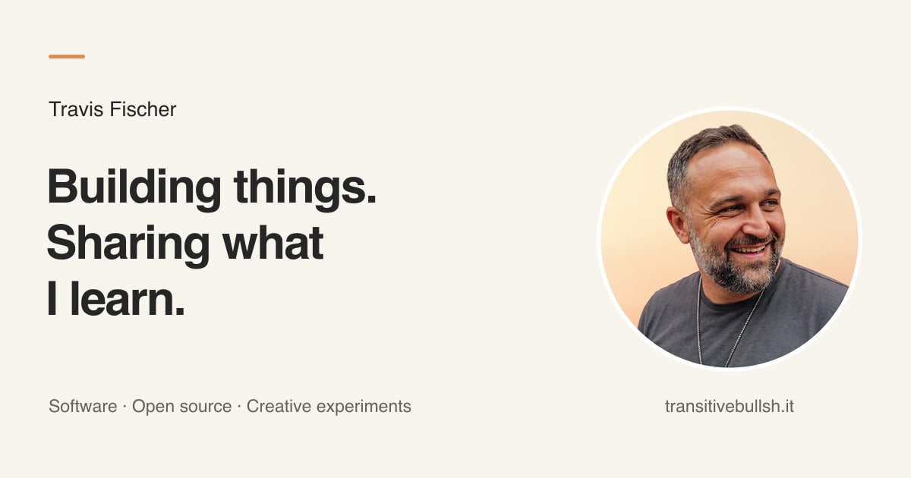

<a href="https://transitivebullsh.it">
  
</a>

# TransitiveBullsh.it

Travis Fischer's personal website. Next.js renders versioned article snapshots imported through the official Notion API, with durable media in Cloudflare R2.

## Development

```sh
pnpm install
pnpm dev
```

A saved `content/snapshot.json` is required. Normal development and builds use it without CMS or storage credentials.

## Content

```sh
pnpm content:sync --dry-run
pnpm content:sync
```

See [Content sync](docs/content-sync.md) for setup, flags, caching, and exit codes.

## Checks

```sh
pnpm fix:format
pnpm fix:lint
pnpm test
pnpm build
```

Implementation checks are recorded in [docs/verification.md](docs/verification.md).
